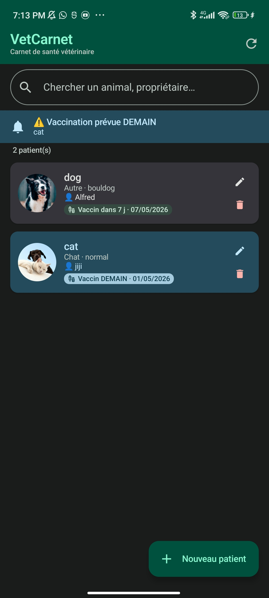
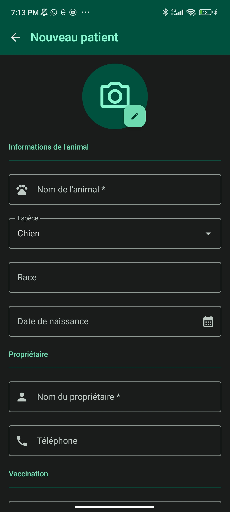
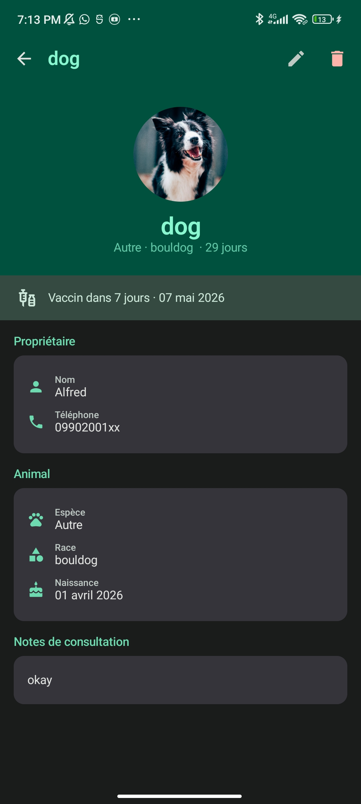
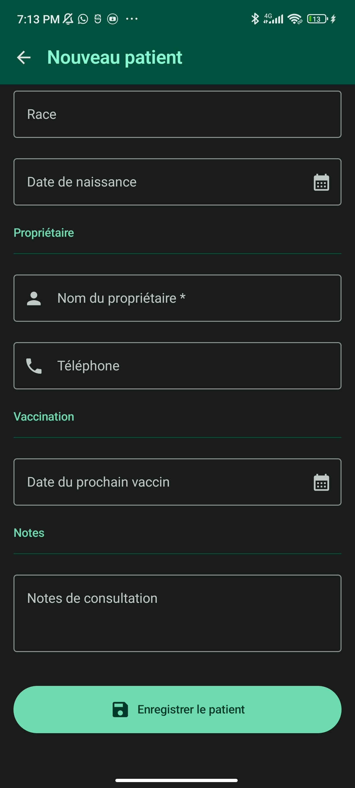

# VetCarnet 🐾
### Carnet de Santé Vétérinaire avec Rappels de Vaccination

Application Android native (Jetpack Compose) permettant à un vétérinaire de gérer les dossiers de ses patients animaux et de recevoir des alertes automatiques avant les vaccinations.

---

##  Fonctionnalités

| Fonctionnalité | Détail |
|---|---|
| **Liste des patients** | Cartes avec photo, espèce, propriétaire, badge vaccin coloré |
| **Création** | Formulaire complet avec photo |
| **Modification** | Mise à jour du dossier après consultation |
| **Suppression** | Avec dialog de confirmation |
| **Notifications** | Alerte automatique J-1 et J0 |
| **Recherche** | Filtrage temps réel |
| **Mode sombre** | Thème clair et sombre automatique |

---

## Aperçu de l'application

|              Liste des patients              |               Nouveau Patient               |               Détails Patient                |                     save                     |
|:--------------------------------------------:|:-------------------------------------------:|:--------------------------------------------:|:--------------------------------------------:|
|  |  |  |  |


## Architecture

```
MVVM + StateFlow + Jetpack Compose
```

```
UI (Composables)
    │  observe StateFlow (collectAsStateWithLifecycle)
    ▼
ViewModel (viewModelScope.launch)
    │  appelle
    ▼
Repository (interface + impl)
    │  utilise
    ▼
Supabase SDK (Postgrest + Storage)
```

---

## Système de Notifications (WorkManager)

```
MainActivity.onCreate()
    └── VaccinationCheckWorker.schedule(context)
            └── PeriodicWorkRequest (répétition : 1 jour)
                    └── VaccinationCheckWorker.doWork()
                            ├── Requête Supabase → liste des animaux
                            ├── Filtre : date_prochain_vaccin == aujourd'hui OU demain
                            └── NotificationCompat → notification groupée
```

---

## Installation

### 1. Prérequis

- Android Studio Hedgehog (ou plus récent)
- JDK 11+
- Compte Supabase (gratuit sur [supabase.com](https://supabase.com))

---

## Structure des fichiers

```
app/src/main/java/com/vetcarnet/
├── MainActivity.kt                     # Entry point + NavHost
├── VetCarnetApp.kt                     # Application class
│
├── domain/model/
│   └── Animal.kt                       # Modèle métier + enum Espece
│
├── data/
│   ├── remote/
│   │   ├── SupabaseClient.kt           # Client Supabase singleton
│   │   └── AnimalDto.kt                # DTO Kotlin Serialization + mappers
│   └── repository/
│       └── AnimalRepository.kt         # Interface + implémentation CRUD
│
├── worker/
│   ├── VaccinationCheckWorker.kt       # PeriodicWorkRequest + notifications
│   └── BootReceiver.kt                 # Replanification au démarrage
│
└── ui/
    ├── theme/
    │   └── Theme.kt                    # Palette MD3, Poppins, Shapes
    ├── components/
    │   └── AnimalCard.kt               # AnimalCard + VaccinationAlertBanner
    └── screens/
        ├── list/
        │   ├── AnimalListViewModel.kt
        │   └── AnimalListScreen.kt
        ├── detail/
        │   ├── AnimalDetailViewModel.kt
        │   └── AnimalDetailScreen.kt
        └── form/
            ├── AnimalFormViewModel.kt
            └── AnimalFormScreen.kt
```

---
